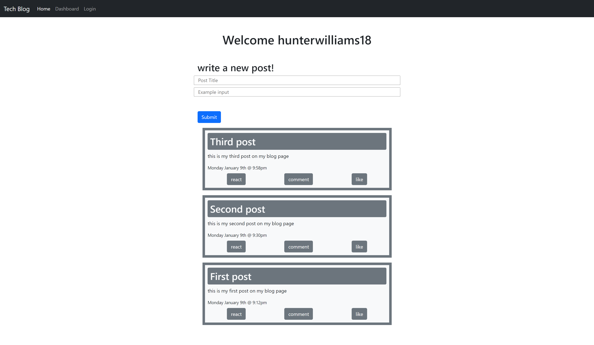
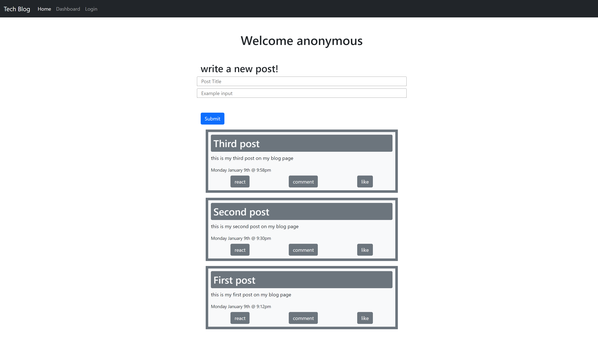
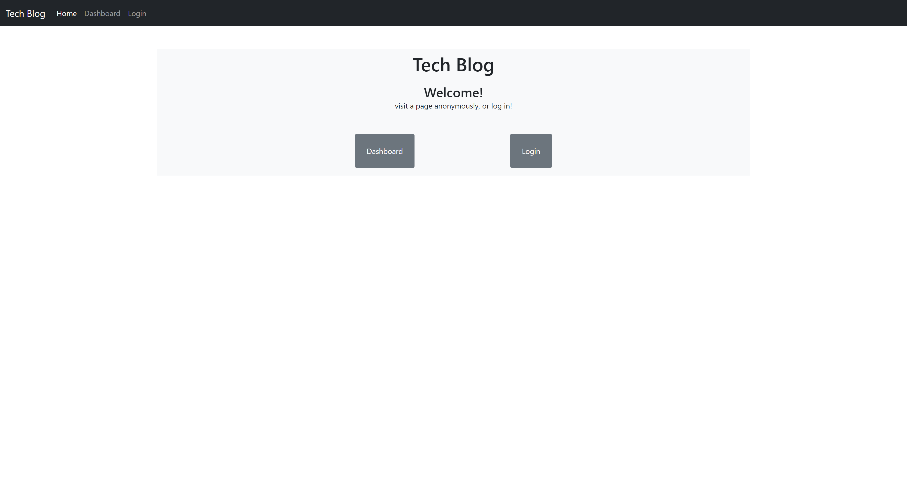

# tech blog 
- sign in to your blog and scroll or comment on other blog posts

# live link
# [tech-blog-mvc-api.web.app](https://tech-blog-mvc-api.web.app/)
**hosted on firebase because of heroku paywall**

## images

### firebase notes
- public holds static files
- funtions holds dynamic server files
    - want this for handlebars - templating